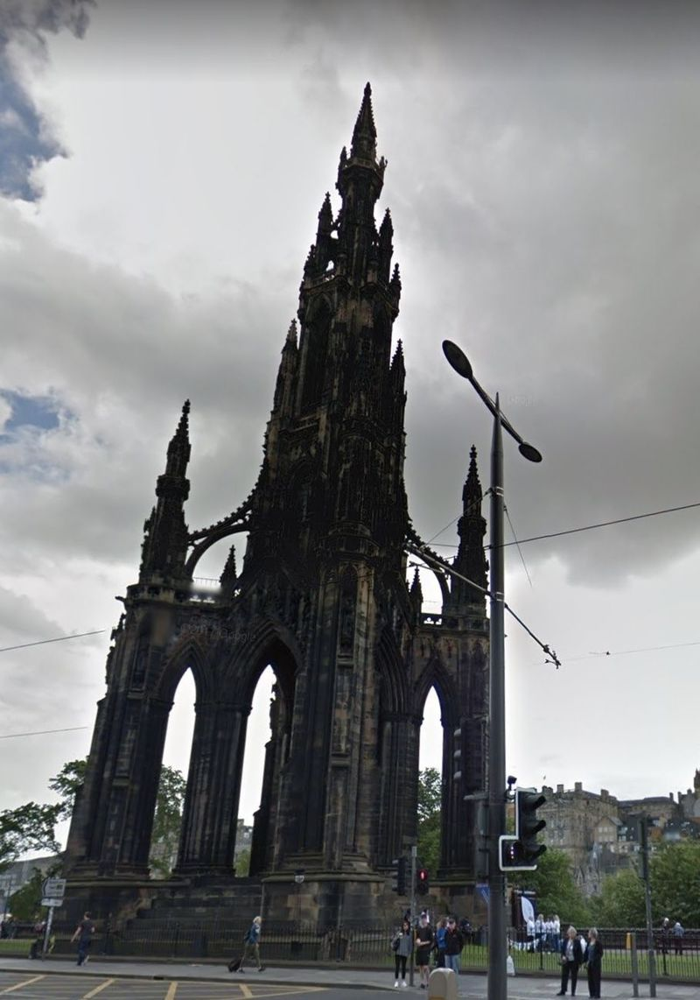
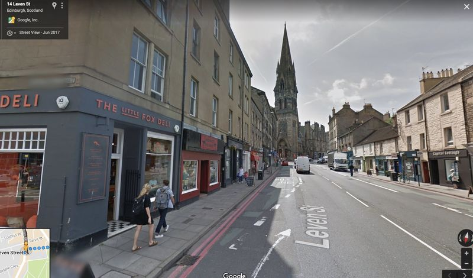
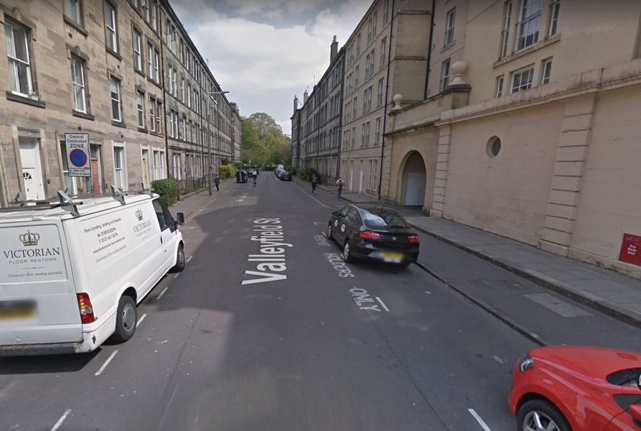
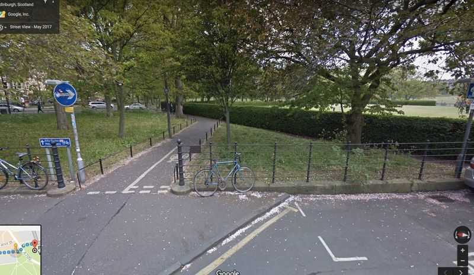

# Public Transport:
1. From Waverley Station, exit onto Princes Street via the Waverley Steps exit.
2. Turn left and walk along Princes Street towards the Scott Monument. You should cross one road and be walking along with Princes Street Gardens on your left.

3. Just after the Scott Monument should be bus stop PR.
4. Take Lothian buses 11, 16, or Stagecoach 102 six stops to Leven Street, next to Pekoe Tea.

5. Walk with the road on your left, and turn the corner at the Little Fox Deli, down Valleyfield Street.  You should see the greenery of the Meadows ahead of you.

6. Continue in a straight line across Level Terrace.

7. Keep going straight ahead, following the short cycle/pedestrian path across Melville Drive.
[Melville Drive](PT img 5 - melville dr.jpeg)
8. The Meadows is straight ahead of you - the Prince Albert Victor Sundial should be ahead slightly to your right, in the middle of the grassy area.
[sundial](Sundial.jpg)

# Walking:
Walking distance from Waverley station is 1mile, approx 20-30mins.
1. Leave Waverley Station from the Waverley Bridge exit and turn left.  Keep going until you reach the roundabout at Market Street.
[Waverley Bridge and roundabout](W img 1 - waverley bridge.jpeg)
2. Turn right along Market Street; Princes Street Gardens should be on your right.
3. Cross the road and go left up the News Steps.  *for a route avoiding stairs, keep going down Market Street then take the first left onto New Bank Street.  Keep going then turn right to rejoin the directions at step 5*
[News Steps](W img 2 - news steps.jpeg)
4. Turn right at the top of the steps along St Giles’ Street.
5. Take the first left onto Bank Street. 
[Bank Street](W img 3 - Bank street.jpeg)
6. Keep going straight, Bank street will turn into George IV Bridge.  You should pass The Lothian Chambers and National Library of Scotland on your left, then Central Library, The Elephant House and the Statue of Greyfriars Bobby on your right. 
[Greyfriars bobby](W img 4 - bobby.jpeg)
7. Cross Candlemaker Row, and take the right fork along Forrest Road, right of the church with the big red door. 
[Forrest Road](W img 5 - Forrest road.jpeg)
8. You should see the greenery of The Meadows directly ahead of you.  Keep going straight down Middle Meadow Walk
[Middle Meadow walk](W img 6 - mm walk.jpeg)
9. Turn right at the bottom of Middle Meadow Walk, where the path splits, onto North Meadow Walk, and follow the edge of the Meadows with the Meadows on your left.
10. Keep going straight ahead.  Soon after you cross Coronation Walk, you should see the sundial ahead of you on your left. 
[sundial image](Sundial.jpg)

# Directions to the Pavilion Cafe from the Sundial (in case of rain)
The pavilion Cafe is at most 5mins walk from the sundial, and offers some shelter in the event of rain.  They also serve hot drinks and food, and there is a toilet.  You should be able to see it from the Sundial, but if you are unsure, follow these directions:
1. Head towards the nearby road that runs through the Meadows, Melville Drive.
[Melville Drive](Rain - img 1 melville dr.jpeg)
2. Walk along Melville drive with the sundial on your left.
3. The Pavilion cafe will be on your left. 
[Pavilion cafe](Rain - img 2 pav.jpeg)
